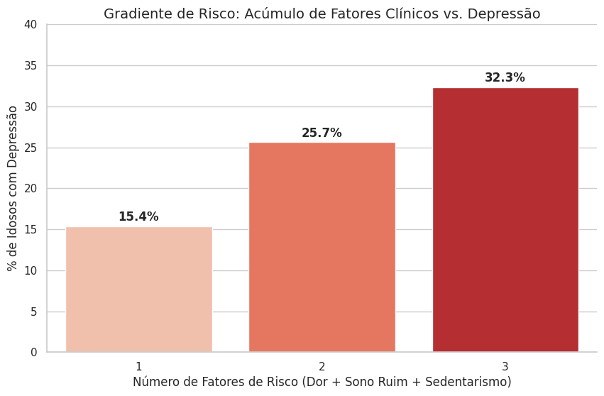

# 🩺 Predictive Modeling of Geriatric Depression: ELSI-Brazil Study

This project leverages **Data Science** and **Machine Learning** to identify clinical predictors of depression among the elderly in Brazil. Using the **ELSI-Brazil (Brazilian Longitudinal Study of Aging)** database, I developed a model to screen for high-risk profiles based on modifiable clinical factors.

---

## 🎯 Research Objective
To determine how clinical comorbidities (chronic pain, sleep quality) and behavioral factors (physical activity) interact to predict depressive symptoms in a population of ~10,000 elderly individuals.

## 📊 Key Findings

| Clinical Profile | Depression Prevalence | Impact |
| :--- | :---: | :--- |
| **1 Risk Factor** | 15.4% | Baseline risk in the study |
| **2 Risk Factors** | 25.7% | Significant clinical increase |
| **3 Risk Factors** | **32.3%** | **Double the baseline risk** |

* **Clinical Sensitivity (Recall):** The model achieved **77% Recall**, prioritizing the identification of at-risk patients (minimizing false negatives), which is essential for public health screening.
* **The "Pain-Depression" Axis:** Chronic pain was the most significant individual predictor, acting as a primary gateway to depressive symptoms.

## 🛠️ Tech Stack & Methodology
* **Language:** Python 3.x
* **Data Science:** `Pandas`, `NumPy`
* **Machine Learning:** `Scikit-learn` (Decision Trees, Logistic Regression)
* **Visualization:** `Seaborn`, `Matplotlib`
* **Key Techniques:** Class Balancing (handling imbalanced healthcare data), Feature Engineering, and Epidemological Data Cleaning.

## 📈 Visual Analysis
*The chart below illustrates the "Dose-Response" relationship between the accumulation of clinical factors (Chronic Pain + Poor Sleep + Sedentarism) and the prevalence of depression.*

## 📊 Data Source: 
This study uses data from the ELSI-Brazil, which is supported by the Brazilian Ministry of Health and the Ministry of Science, Technology, and Innovation. Citation: Lima-Costa MF, et al. The Brazilian Longitudinal Study of Aging (ELSI-Brazil): Objectives and Design. Am J Epidemiol. 2018.
---

## 🇮🇹 About the Author
**Medical Student** (Brazil) transitioning into **Digital Science**. My goal is to bridge the gap between clinical practice and predictive analytics to improve geriatric care and public health policies. 

